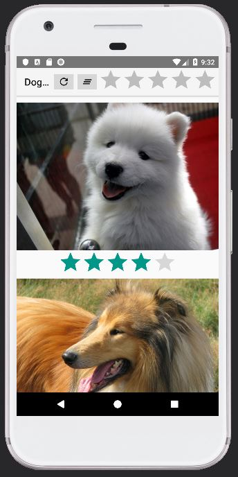

MyGallery (doggos) is an Android Studio project made using java to display cute dog pictures in a gallery-like app with additional featres like rating and filtering. MVC pattern, recycler view and asynctask were used in creation of the app.

